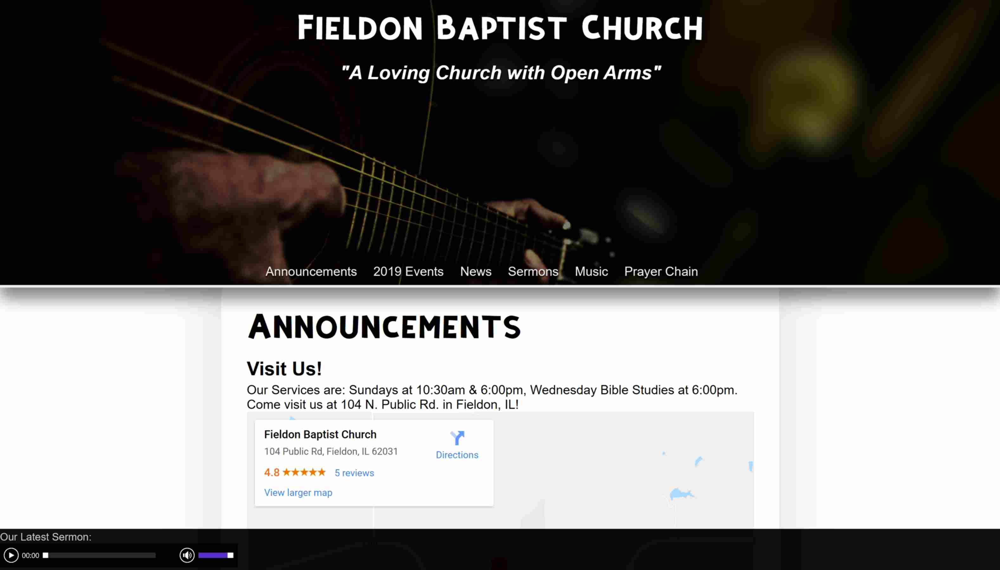

# Project Portfolio

## Websites
Note: All websites are in client control and are no longer maintained by me unless stated otherwise.

### Personal Site
This personal site is a project implemented as a true continuation of my original SIUE student site.
It has gone through a few iterations and came to know its place on `misterbutterfly.github.io`, then  `joshuaspann.github.io` until I purchased `joshuaspann.com`.
The 2013-2019 version of the site was made up of pure HTML from scratch.
As of September 2019, the site utilized markdown mixed with HTML, all hosted on GitHub's Pages.

### SIMS: SIUE Fake Nursing Charts
A fake charting system implemented in Wordpress, maintained during my time at SIUE.
The initial design was to be a system built from scratch or existing FLOSS EMR/EHR systems.
Administration desired a Wordpress-based solution because they were sold during a conference talk about using Wordpress for personal hosting.
I had to work within constraints but was able to extend Wordpress to meet simulation needs.

The site is integrated with SIUE's Central Authentication Server, allowing access only with a proper university-issued username and password.
Most content is created like a regular Wordpress site though there is a custom navigation element added to each page.
The layout poorly attempts to mimic Epic but in a simpler and reduced design.
The system was modified to be more easily customized and focuses on all fake patients from a single-page-app perspective.

The goal is to further extend the system so it can be integrated with our LLEAP simulation software.
The integration will allow automated changing of patient records during sim.
An action in LLEAP will trigger a change in the MAR or the Lab results during sims for a more immersive experience.
The system is also planned to allow student practice during lab time, which will routinely empty all submissions within a given period.

### Building Student Writers
A custom Wordpress site hosted on my servers when I provided web hosting through my web-design business, Monada.
There was nothing overly spectacular, just a simple Wordpress site that implemented a custom CSS theme.
After an extended grace period of late payments the site was shut down.

### JB's Smartphone Repair

A customized weebly site that was made under my personal web-design business: Monada Software (formerly Quantum Develop).
It was customized on the PHP level to better control functionality of the site and was made to be easily maintained by the client.
I established the artistic direction of the initial site in 2017 and helped them easily integrate an existing form (in an iframe) into the website.
I also helped with DNS redirection to ensure that the website would transfer from the original GoogleSites page to the Weebly site.

### Fieldon Baptist Church

A dynamic website that was primarily for content display.
The website was built with responsive design as a core approach from the onset.
It was written from the ground up to be more scalable and fit more closely with the MVC (Model View Controller) architectural style.
It was the first major PHP-based website that I had developed.

### FREUD Engine
A project created by an instructor from SIUE, FREUD was an engine that was part of an applocation named FIRST. 
The project was a web-based solution that dealt with quotes and insurance for weather damaging and repairs.
I contributed to display logic and improving the UX design.
The FREUD/FIRST system was an internal project rather than a public site/system.

### Home of the Hat
One of many senior projects for SIUE.
The website acted as a display portal for all of my university work from development projects, artworks, music, and even a personal resume.
Home of the Hat has since been reimagined into two separate websites.
One is now more of an online resume showcasing professional work, while the other is a project website for graphic design, open source, and other miscellaneous projects.

In late 2018 SIUE had changed the network configuration that ended up scrapping all of the legacy sites on the old server.
They established a new setup since then so the original site has been lost.

---

## Software Projects

All of my available software projects can be viewed on GitHub! You can view them on [github.com/joshuaspann/](https://github.com/joshuaspann)

### `JOSH`: The Java Object Shell

- **Language:** `Java`
- **Platform:** JVM, Console/Command-Line, Terminal
- **Started:** Jul 2019
- **Status:** In development

Inspired in part by the original concepts behind Powershell with a bit of TempleOS for good fun.
The shell is an attempt to handle Java objects natively instead of piping text back and forth between apps.
The name of `JOSH` is purely coencidental; I'm not that egotistical to name it after me.
The name came from the initial project goal, having an operating java shell.
I wanted the name to be easy to say and catchy like "bash" and thought up "The Java Operating Shell".
I thought of how to compact it down and got "JOSH" as a result.

`JOSH` is an attempt to make certain features and ideas easier to implement.
It focuses on experimenting with new ways to handle data as well as navigation and commands.
There is the concept of "nodes", where numbers represent the counted node in the working directory.
You can use nodes in interesting ways, though the shell will default to files or folders with numbers in the name if they exist.

The shell attempts to guess the intentions behind commands to shorten them.
You enter a string suffixed with a file delimiter and it attempts to change to the directory.
You can also enter a node number to imply the same.

If you start a command with a number, it will attempt to iterate the following command that many times.
If the number is followed by numbers, then it is assumed to change to those directories.
The commands are intended to work as standalone applications or they can be used as intended as a part of `JOSH`.

To see my latest changes and experiments with the project, you can examine my repo at [github.com/joshuaspann/josh](https://github.com/joshuaspann/taskbar).

### `Taskbar`: Added Features

- **Language:** `Java`
- **Platform:** Android
- **Contributions:** Jul 2019
- **Status:** Merged as of Jul 23

Added functionality to the [original Taskbar repo](github.com/farmerbb/Taskbar). 
I noticed that it did not have the ability to customize the 'start menu' icon outside of two embedded images within the app. 
I added the ability to allow the user to specify if they desired to use a custom image from their phone. 
If te setting was checked and a file specified, the taskbar would update with the custom image the user chose via a filepicker. 

To see my latest changes and experiments with the project, you can examine my fork at [github.com/joshuaspann/taskbar](https://github.com/joshuaspann/taskbar).

### `cklist`: A Minimalist Checklist Manager

- **Language:** `C`
- **Platform:** Linux/Unix Console
- **Started:** Nov 2018
- **Status:** "Stable", In Development

A simple command-line checklist application that manages lists through files and folders. 
It is basically a merged reimplementation of common Unix commands like `touch`, `mkdir`, `ls`, and `rm -rf`. 
The concept came as a way to reduce keystrokes while managing checklists made from files. 
The project page is at [github.com/joshuaspann/cklist](http://github.com/joshuaspann/cklist)

## `Raspy LCDriver`: Controlling a Character LCD from the Pi

- **Language:** `Python 3`
- **Platform:** Linux, Raspberry Pi
- **Started:** Jul 2018
- **Status:** Unstable, Abandoned

An excercise to get familiar with the Raspberry Pi's GPIO pins on Linux. 
Inspired by some 8-Bit Guy YouTube videos, I reimplemented David's solution on a RaspberryPi 3 instead of a Commodore64. 
It started as an 8-bit counter up to 256 values with just LEDs. 
I added python code to parse a given character to the character code on the LCD. 
I did a lot of research and created my own circuit to manage and control a large character LCD. 
After printing out many characters in a row, some tweaks were made to have the LCD print messages. 
I then started creating a shell in Python, which would take in keystrokes and parse commands like bash or any other shell. 
The difference was to have it save each character and send the LCD code to the screen in real time. 
It was almost complete but was abandoned with an increased workload and wedding planning. 
It is currently two separate applications that have yet to interface with one another.

## `timec`: A Simple Time Converter

- **Language:** `C`, `Haxe`, `Python 3`
- **Platform:** Linux/Unix Console
- **Started:** Jun 2018
- **Status:** Stable, In Development

A command-line calculator that converts given times into different formats. 
It started to simply convert a mm:ss format to a decimal formatting of mm but grew with more needs. 
I added the ability to make it convert times from 24-hour to 12-hour formatting. 
The need also arose to find the time difference between two times in a mm:ss format, so I added that as well. 
Out of curiosity, as a benchmark to compare multiple languages, I rewrote it in Haxe then in Python to compare how each platform performed.
I also looked at compiling it to C++ via Haxe's utilities and Cython. 
Rewriting it helped me to find areas to improve the software and give me ideas of additional functionality. 

The project page is at [github.com/joshuaspann/timec](http://github.com/joshuaspann/timec)

## `Arch-Linux Node`: A Persistent Live USB

- **Platform:** Linux
- **Started:** Apr 2018
- **Status:** Up-to-date as of 2019

A series of steps and commands to make a persistent Arch-Linux install on a USB stick. 
It is bootable, while files can be accessed by all platforms without the need to boot. 
It boots on most i386 and amd64 processors in both BIOS and UEFI modes. 
It originally used a UDF-formatted drive but concerns led me to partition the drive to have a shared place. 

The shorthand notes/instructions can be found at [github.com/JoshuaSpann/help/blob/master/linux/portable-arch-usb-install.md](https://github.com/JoshuaSpann/help/blob/master/linux/portable-arch-usb-install.md)

## `Simulation Checklist`: A Mobile Management App

- **Language:** `Dart`
- **Platform:** Flutter (Android)
- **Started:** Apr 2018
- **Status:** Stable, Abandoned

A quick project to get familiar with the Flutter framework and Dart language. 
It was intended to display a list of checklists that could be individually viewed and modified. 
The changes would not be persistant outside of adding/deleting items.
Due to personal time constraints and Flutter feeling like Google's take on ReactNative, the project has since been abandoned. 
It is missing the ability to save or modify checklist items, though it is usable. 

## `Daily Droid`: A Smartphone Journaling App`

- **Language:** `Java`, `Kotlin`, `XML`
- **Platform:** Android API 26
- **Started:** Nov 2017
- **Status:** Stable, In Development

A configurable, multi-activity Android applicatioin that acts as a glorified text editor. 
It was concieved as a response to my dissatisfaction of having to remember everything and handwrite it at the end of each day.
I would lose 2-4 hours of sleep writing in my journal.
Diction significantly reduced the time, but it was hard to convert to text accurately and took up significantly more space.
Not to mention, trying to search an audio file for something was very impractical (especially if you forgot the date).
Typing at the end of the day was better, but everything was just bundled into a large amount of time wasted.
It was built due to other text editors being slow, rife with ads, or counterintuitive. 

It creates text files named by the timestamp created.
It uses quick buttons to navigate and add markdown to the text files.
If the user specifies so, the app can also auto-log incoming and outgoing calls as markdown.
Users can also persistently change colors of the current text file to one of many preset colors for easier organizing and customization.

I was inspired by the default Memo app on Samsung smartphones, but put off that it exported to PDF. 
I wanted timestamps, markdown, the ability to navigate the document with a few taps. I had to start from scratch, so I wrote my own.
It started as a "Text File Writer" that simply allowed a user to save text files via a single activity. 
It had the ablity to not only create text files, but add time stamps at the tap of a button. 

The need for enhanced navigation caused more buttons to be added, allowing navigation between the beginning and end of a file. 
I made it autosave as long as characters are added, allowing accidental deletions to be undone. 
The default scroll behavior was not fluid and did not traverse well, so I reconfigured that. 
I then added the ability to colorized given text files as a way to visually categorize them. 
I made it capable of automatically log incoming and outgoing calls by inserting timestamps with the basic call information into the text file. 
I added the ability to manually and hot-refresh the file to ensure that no up-to-date changes were lost in the background. 
The app also allows users to adjust settings, such as syntax highlighting for markdown support or the ability to control whether calls are auto-logged. 

The project page is at 
[github.com/joshuaspann/daily-droid](http://github.com/joshuaspann/daily-droid)

## `LLEAP Patient Info Plugin`: An Instructor Application Extension

- **Language:** `C#`
- **Platform:** .NET with the Laerdal SDK
- **Started:** 2017
- **Status:** Stable, Completed

A simple extension to the LLEAP Instructor App (IA) that allowed the viewing of patient info given in scenario files. 
It obtains the patient data and display it in the IA interface as a window that can be added/modified. 
Certain tweaks have to be made to the scenario file with UD variables as the Laerdal SDK does not support all patient info like the patient name, birthday, etc. 
It also was bundled into a self-extracting executable that would extract a copy of all DLL files and the plugin to the proper Laerdal directories. 

## `Dot QR`: An Inkscape Plugin

- **Language:** `Python`
- **Platform:** Inkscape
- **Started:** Nov 2017
- **Status:** Stable, Completed

A customization of the base barcode extension in Inkscape. 
A checkbox for using dots instead of squares was added to the QR Code GUI's .inx and the rendered QR code would be rendered in a pretty, dotted format too. 
This reduced manual, time-consuming work to the instant check of a checkbox and click of a button. 

You can download a [zip file of DotQR here](../resources/dotQR.zip).

## `Video Text Balancer`: A Plugin to Ease Video Editing in Blender

- **Language:** `Python`
- **Platform:** Blender 3D
- **Started:** Nov 2017
- **Status:** Stable, Completed

A Blender3D UI customization in Python to help speed up video development. 
A button was added in the VSE to loop through all selected text objects in the video editor, make them have a minimum specified length, and then space them apart so they do not overlap.

## Auto-Flag RMA Opportunity Trigger

- **Language:** Apex, Visualforce
- **Platform:** Salesforce
- **Started:** Jan 2017
- **Status:** Stable, Completed

Because a workflow didn't allow the Opportunity Stage field to be modified via the workflow.
An apex trigger was used instead.
The trigger ran on the creation of new records only.
If there was a certain country code (US or UK) that was chosen for the record, the Opportunity's Stage would be auto-updated to a custom RMA picklist value.
The need was to help expadite the Salesforce proccess of the client and to better match their business process.

## RMA Mass Automation Scheduled Apex Job

- **Language:** Apex, Visualforce
- **Platform:** Salesforce
- **Started:** Oct 2016 - Feb 2017
- **Status:** Stable, Cancelled

A massive scheduled Apex class that automated the RMA process daily.
Automated emails would be sent 2 days after the owning Case's follow-up date and the final email would vary when it was sent.
The final email depended on the RMA type being old process or new process.
Checks would be run to determine if the emails, phone tasks, and all other tasks were completed before progressing.
The first email would be sent, then if it was a phone task would be assigned to a user.
If the (standard process) phone task was assigned and then completed, the RMA would be flagged as charged and a final email would be sent.
If the final email was sent, then the case would auto close (if old process) or a task would be assigned to close the owning case (if standard process).
The automated apex emails were also linked to the owning Case's activity history and open activites.
This project had a lot of scope creep since its onset, where my company was willing to add changes since the client did not have a standard payment process.
It evolved from a simple email and phone?call checker to a data factory that also closed orders and further made the functionality dynamic; requiring 
multiple records from great grandparent and great great grandchildren objects that were out of the normal Salesforce limits on generational data to object traversal.

## Teamwork API Callout Connector

- **Language:** Apex, Visualforce, JSON
- **Platform:** Salesforce
- **Started:** Dec 2016 - Feb 2017
- **Status:** Stable, Abandoned

A quick pet project to provide basic GET and POST functionality provided via HTTP REST callouts.
Custom fields and tables were made to match the structure of a Teamwork Projects organization.
API tokens and authentication was dynamically handled and allowed the posting of time entries from Salesforce to Teamwork.
The project utilized callout classes and triggers to fire off correctly whenever a time entry was made or updated.
The connector also was created as a Salesforce App that ran in the traditional layout as well as Lightning and the Salesforce1 mobile app.
This allowed for time entries to be tracked and reported in Salesforce to run a greater variety of reports than Teamwork provided.
The goal was to gain more knowledge of both the Teamwork API as well as direct Salesforce integration with other web applications.

## Flag Project Details

- **Language:** `C#`
- **Platform:** Epicor CRM
- **Started:** 2016
- **Status:** Stable, Completed

This was a form customization that utilized the base project form deeply stripped of its excess functionality.
The form was made simple, to load all projects that met a date range, or met a project code, or met a project code within a given date range.
The form was the first customization at my company where an updatable BAQ was linked to a form customization and updated via an impl on the adapter business object.
The BAQ would then flag certain fields that met the criteria given in the form and update via the BAQ.
However, the BAQ ran on a table that did not call the correct methods and had issues inserting more than 50 records to the database.
The limitations slowed down the system and a method directive was decided to be the best approach moving forward.

## Credit Card Management Integration

- **Language:** `Apex`, `Visualforce`, `Javascript`
- **Platform:** Salesforce
- **Started:** 2016
- **Status:** Stable, Completed

A project where a previous middleware company left broken and unfinished code on a client's Salesforce organization.
The default code was improved upon and I was able to complete it and make it fully functional.
The program also had some improvements for displaying error messages and error handling.
The code was then modified to work with new use case requirements that required an extension on the existing apex code.

There were 3 major pages involved: credit card selection, credit card entry, and a credit card assignment page.
The selection page allowed selection from a listing of valid credit cards assigned to the account.
The entry page allowed entry of a credit card or modification of an existing one.
The assignment page allowed credit cards to be assigned to accounts.

Each page also had controller extensions linking to the existing credit card utility classes.
A custom javascript button was used to prevent API submission of orders for certain RMAs that did not have a valid credit card.
Validation was done by a HTTP Callout class that received major credit card information from credit card companies.
The callout would verify that the credit card number existed in the earlier form entries.
If no credit card was assigned or had expired, then the javascript button would alert the users.

## TSQL to Excel Reporting Data Dump

- **Language:** `TSQL`
- **Platform:** SQL Server
- **Started:** 2016
- **Status:** Stable, Completed

A simple application that performed financial lookups and reporting on a SQL Server database.
The lookups filtered inventory and tracked costs per warehouse as well as per region and overall.
The financial report would also perform complex business calculations and then write to Excel.
SSRS was not perferred by the project manager, so elevated permissions and outdated techniques were used to dump the data to an Excel file.

A concept application was also made as a backup and would perform the same as a standalone C# app that ran as a cron job.
The TSQL would then be set to run on scheduled intervals every few days, but not as a stored procedure.
The Excel file would be written but not overwritten once created.
New files would be added for each run to provide a better snapshot for the client.
Excel templates were also created to meet the client's needs.

## Price Listing Inquiry Form

- **Language:** `C#`
- **Platform:** Epicor CRM
- **Started:** 2016
- **Status:** Stable, Completed

A client requested an extension to the Epicor base Price List Inquiry form.
The extension required a custom sheet that allowed quick addition of Quotes or Orders with a miniature form that would load new or existing entry forms.
The forms would auto?populate based off of the parameters launched from the other form.
I was the first in my organization to implement such functionality.
The Quote/Order forms would populate billing and shipping information differently and had to be extended to support the data sent from the PLI form.
Quotes required the same bill-to and ship-to address as the customer's address.
Orders would defult to the standard billing/shipping addresses, but would also auto select a proper warehouse to link to the order.

## API Usage Reporting

- **Language:** `C#`
- **Platform:** Scribe
- **Started:** 2016
- **Status:** Stable, Completed

A Scribe platform application that allowed reporting to be done in Scribe on the Scribe organization's usage history.
This called the Scribe API to pull organization usage and details for each child organization.
It would also calculate times spent processing records as well as errors encountered.
I initially started the project, swapped between development projects, and trained other developers to get them up to speed with the project.

## RMA Replacement Order Forms

- **Language:** `Apex`, `Visualforce`, `Javascript`
- **Platform:** Salesforce
- **Started:** 2016
- **Status:** Stable, Completed

A custom RMA replacement order page was created, almost identically matching the Create Free Part RMA Order Visualforce Page project.
This form, however, looked at all products.
Another difference was the ability to see all products or only products meeting certain groups or other criteria.
The criteria would be the RMA type as well as user?selected radio buttons.

The page would also have the ability to filter products by their associated pricebook entries.
All pricebooks were set to a picklist which was then defaulted to the Retail pricebook, or any pricebook with "retail" in its name if there was no lone "Retail" pricebook.
The selected pricebook would not only filter the products available, but it would also change the prices accordingly.
Only pricebooks from the RMA account's default pricebook group were shown.

If there was any invalid data, a custom Javascript button would fire off an alert message and prevent the user from continuing to the page.
Apex extensions were used with the standard controller to provide a robust experience.

## Defect Entry Customization

- **Language:** `C#`
- **Platform:** Epicor CRM
- **Started:** 2016
- **Status:** Stable, Completed

A project breifly picked up by me after another developer could not work on it for a while.
I took an existing form customization layout and added in the functionality to allow the entry and modification of defect entries as well as defect details per entry all in the same form customization.
The trick was to allow out?of?the?box Epicor functionality but create the same grid display results as a BAQ (Business Activity Query).
The issue was working with the Epi Data View and having to code around default issues with utilizing a child data view in a parent.

The child was a UD (User?Defined) extenstion of the parent table.
The similarity of Key fields required careful planning and a creative workaround in the code.
The child UD data view was integrated instead of a BAQ to allow direct Paste to Excel functionality which was a must for the client.

## Job Part Bundling Utilities

- **Language:** `C#`
- **Platform:** Epicor CRM
- **Started:** 2016
- **Status:** Stable, Completed

My first Epicor project.
On the Job Entry Form, when the job was flagged as engineered, all 1st level Subassemblies and Raw Materials would be grouped into unbundled parts.
The unbundled parts showed up on a custom sheet on a bottom grid.
A user could then select multiple Job Assemblies and Materials from the grid and bundle them at once.
Bundled parts will be transferred to an upper grid, where advanced calculations are done to determine remaining quantity.
Any bundled parts exceeding the required quantity (resulting in negative quantity in bottom row) will flag rows to be marked as red.

The user could update, add, delete parts from a bundle.
BPMs fired off to successfully and efficiently manipulate data much faster than an adapter or impl would provide.
After bundling parts, the user will move to a 100% custom Bundle Management (Bundle Shipping) form.
The custom form would allow bundles to be flagged as completed.

A user can also flag a job as completed by shipping it.
Default values are auto assigned for more rapid bundling and shipping.
Bundles can be assigned to a load master with an auto?generated bill of lading number if the user decides to do so.

## Create Free Part RMA Order Visualforce Page

- **Language:** `Apex`, `Visualforce`, `Javascript`
- **Platform:** Salesforce
- **Started:** Sep 2016
- **Status:** Stable, Completed

My first Salesforce project, the Free Part RMA (Return Material Authorization) Page utilized the Salesforce MVC pattern using traditional tools.
The RMA was a custom object implemented to track returns in Salesforce.
The page allowed onlt products flagged as "Free Part Eligible" to be selected from a page block table with a specified quantity and grouped together for an RMA order.
The layout used two grids where the products were selected from the bottom table and assigned to the top table.
Each row in the page block table had a Select button that pulled the product from the bottom grid to the top grid.
Products could be removed from an order (top grid) by clicking a page link while the quantity and RMA reasons could be modified for each individual free part order record.

## API Subscription Checker

- **Language:** `C#`, `TSQL`, `XML`
- **Platform:** Scribe, IIS, SQL Server
- **Started:** 2016
- **Status:** Stable, Completed

My first Scribe API project, the subscription checker was built into an already extensive application that covered two versions of an API to integrate with.
The checker would sent a web callout to a SQL Server instance that would return queried key values and information like key expiration dates and key hashes.
These values would then be evaluated on the Scibe client side and prevent organization access if the subscription key was invalid or expired.

The server-side portion of the Scribe API Subscription Checker used a custom database that was created to work with an old, existing IIS API.
The IIS app was updated and the database would hash, salt, and securely store user data as well as subscription keys.
It would then return the needed values through SOAP.

## SIUE Senior Project Presentation

- **Language:** `Python`
- **Platform:** Blender 3D BGE
- **Started:** 2015
- **Status:** Stable, Completed

A simple presentation  in the form of a playable minigame.
As I was graduating the School of Business, I needed to give a presentation that sold my skillset.
I found a unique way to mix business presentation with computer systems and art in the videogame medium.

The presentation was built with the Blender Game Engine in the Blender 3D software.
The player is a rolling ball with a fedora hat (my signature look) that rolls to different parts of a platform.
The player can view basic presentation content in any order they desire or they can simply roll around the stage.

You can download [a zipfile of my presentation here](jspann_senior_project_presentation.zip).

## Customer Contacts Tracker

- **Language:** `VBA`, `SQL`, `XML`
- **Platform:** Microsoft Access
- **Started:** 2015
- **Status:** Stable, Completed

A small extended customization of an existing template database and form structure.
The system was architected and built initially to work exactly as the client specified but project management decided that form was perferred over function.
As sole developer I had to write complex queries and VBA code to extend the template to meet the use case requirements.
Much of the existing template fields were replaced and programmatically populated from the VBA code extensions and Macros.

## Irresistorable

- **Language:** `Python`
- **Platform:** Python Runtime, Command-Line
- **Started:** Apr 2015
- **Status:** Stable, Completed

A script that gives you the value of a traditional 3-band resistor based on the bands' colors.
It was made as I was starting out with electronics to help me quickly get resistor values until I could remember the color values myself.
The script ran a command-line app that prompted for specific values:

- The number of bands
- The colors of each band