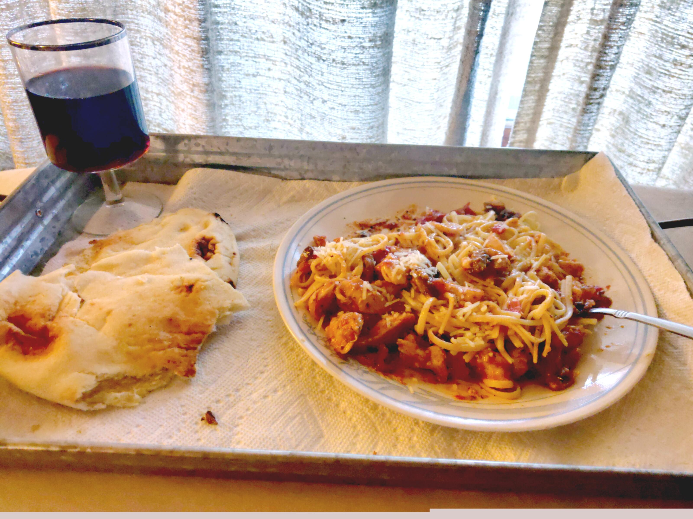
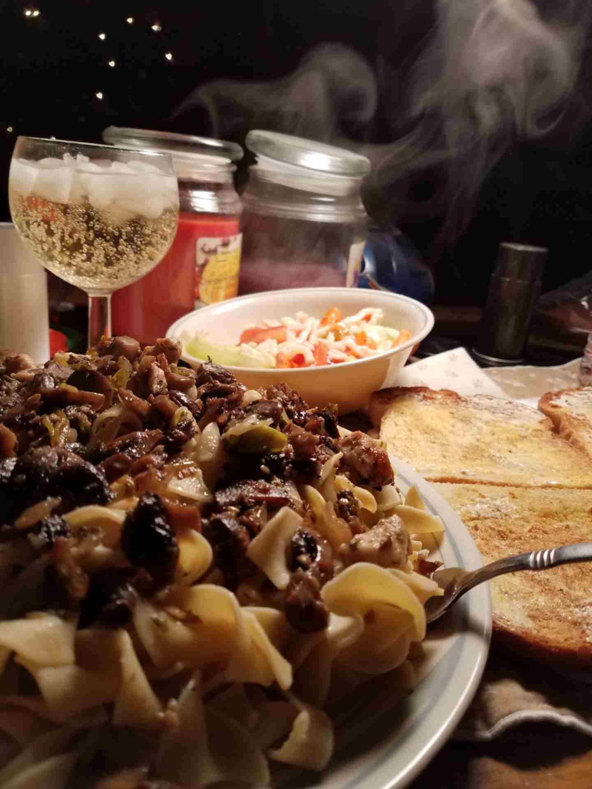

# Recipies

The following are all of my completely original recipies, made from a mixture of family recipies as well as experimentation over the years. I admit I'm not the greatest at keeping track of how much I truly use, I just can tell by looking and tasting when it has too much or too little.
The main reason why these recipies are out here is that there were not enough that I could find online. I wanted mushroom and dandelion recipies and all I got was soup. I got fed up with searching and started messing around. Somewhere along the line I got it!
Plus, it's *really* easy to lose track of recipies scratched down on pieces of paper.
Family recipies are noted in brackets next to the title, everything else is all-original.
Hopefully you can try these recipies out and enjoy them!

## Chicken Linguini

A red Italian dish that goes great with some na'an, Carmello, and a glass of red wine.
This dish provides about 3-4 servings, depending on how much you eat.

### Ingredients

- 2 Boneless, Skinless Chicken Breasts
- 2 cups diced mushrooms

- 1 28oz can of diced tomatoes
- 1 Small onion
- 3 Teaspoons of minced garlic
- 1/3 tube of tomato paste
- 1 teaspoon red wine
- 1 teaspoon of mixed Italian seasoning
- 1/4 teaspoon olive oil
- 2 1/8 sticks of butter
- 5 teaspoons corn starch

- Lemon juice
- Crushed red pepper
- Linguini noodles
- Na'an bread

### Instructions

#### Sauce
1. Dump the can of diced tomatoes into a pan
2. Dice and add the 1/2 an onion in little pieces
3. Add the 3 spoons of minced garlic
4. Put on a fairly decent amount of Italian seasoning and mix it together
5. Add the oil, butter, corn starch, and the tomato paste
6. Add a sprinkle of the red pepper and a couple squirts of lemon juice
7. Add water and corn starch as needed to get the desired consistency

#### Chicken & Mushrooms
1. Cut up the chicken breasts into small pieces
2. Put a small bit of butter or olive oil in a pan
3. Season the oil/butter with mixed Italian seasoning
4. Put the chicken on and season with mixed Italian herbs as you cook
5. Add some corn startch if you desire to have a crispier chicken
6. Once the chicken is pretty much cooked through, add mushrooms
7. Once the mushrooms get soft, add the sauce you made earlier
8. Boil the desired amount of linguini in water
9. Once the noodles are in, take the na'an bread and warm it up in the oven
10. Serve up and enjoy!

---

## CBQ (Currified-BBQ) Steak

A mildly spicy summer dish that goes well with some na'an and some hot weather.
This serves as many people as there are steaks!

### Ingredients
- Ribeye steaks
- Baking potatoes
- Brussel Sprouts
- Curry
- Cumin
- Turmeric
- Garam Masla
- Cinnamon Sugar
- Parsley
- Cilantro
- Salt and pepper as needed
- Cayenne pepper
- Paprika
- Optional (A1 steak sauce, BBQ sauce, Montreal steak seasoning, 1/2 stick of butter)

### Instructions

#### Steaks
1. Put salt and pepper on the steaks (there should be twice the salt to the pepper, get an open and even coating)
2. Put on a small amount of cayenne pepper, then dust it with paprika
3. Put the curry, cumin, turmeric, and a bit of Garam Masla on (2 parts curry to 1 part cumin and Garam Masla, a pinch of turmeric)
4. Add a small bit of cinnamon sugar (2 piches)
5. Put on an even amount of parsley, cilantro, and oregano (there should be a decent amount)
6. Add a heavier coating of curry and garam masla with a few drops of BBQ sauce or steak sauce if you want (you may also use Montreal steak seasoning)
7. Repeat the above on the other side to make sure that the steaks are covered on both sides

#### The Meal
1. BBQ the steaks, making sure to flip them every so often on low heat
2. Bake the potatoes, either on the grill or in a microwave
3. Cook the brussel sprouts as well, and have them lathered in butter
4. You may want to add a bit of seasoning or sauce as the steaks cook, but that's up to you
5. Serve and enjoy!

---

## Chicken Noodle Mushrooms

A nice, lightweight dish that isn't too heavy but just heavy enough.
This recipie creates about 3-4 servings depending on how hungry folks are.

### Ingredients
- 1 bag of egg noodles
- 1 package portabello mushrooms
- 2-3 boneless, skinless chicken breasts
- 2 green onions
- 1 small onion
- 4 tbsp minced garlic
- 2 tbsp cilantro
- 1 tbsp oregano
- 1 1/2-stick of butter
- Salt & pepper
- Water as needed

### Instructions
1. Chop the mushrooms into thumb-sized bites
2. Chop up the onion and green onions into small slivers and rings
3. Melt the 1/2 stick of butter in a pan on low heat, there should be a bit of coverage on the bottom
4. Add the mushrooms with the onions and garlic, put the lid on, and let them sautee (If it is ever too dry, add water as needed by 1/2 cup at a time)
5. Dice up the chicken breasts into little pieces and fry them in a second pan
6. Once the chicken is ready, add salt and a little pepper to the mix with the chicken
7. Add the oregano and cilantro and make sure that everything is mixed
8. Boil the egg noodles for about 8-10 minutes and serve the mushrooms on top when ready!
